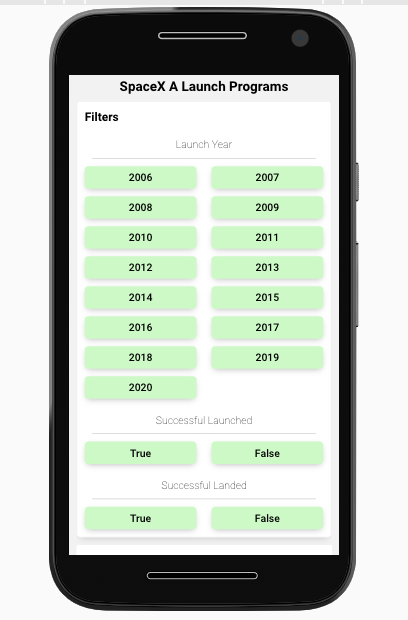
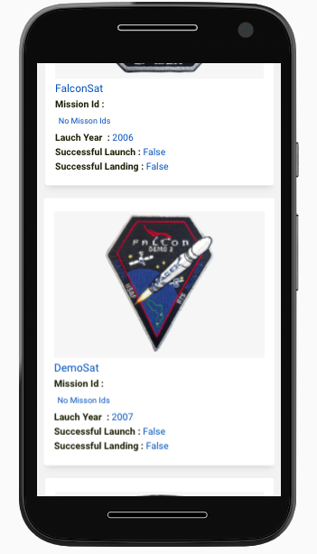
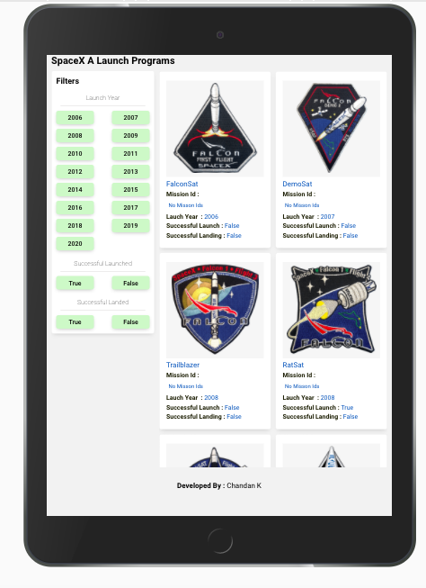
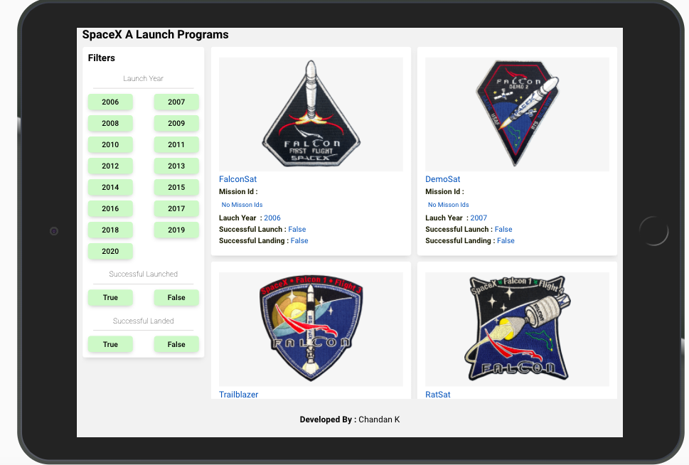

## SpaceX Programs

An application helps users list and browse all launches by SpaceX program.
This application is built using ReactJS, Redux, Html, Sass. Jquery.


Project Screen Shot(s)








## Installation and Setup Instructions

Clone down this repository. You will need `node` and `npm` installed globally on your machine.  

Installation:

    `npm install`  

To Run Test Suite:  

   `npm test`  

To Start Server:

   `npm start`  

To Visit Deployed App:

   `https://spacex-program.netlify.app/`

## Approach

I considered client side fliter with multiple year select approach. For this i am using Javascript State Management Tool Redux. 

To Install Redux : 
    `npm install react-redux`


Created a Reducer at src/Reducer/Reducer.js. This describes how an action transforms the state into the next state.


Creating a Redux store holding the state of SpaceX Programs (src/store.js)

```js
import { createStore, combineReducers, compose, applyMiddleware } from "redux";
import { flightsReducer } from "./Reducer/Reducer";
import thunk from "redux-thunk"; 

const initialState = {};

const reducer = combineReducers({
  allflights: flightsReducer,
});

const composeEnhancer = window.__REDUX_DEVTOOLS_EXTENSION_COMPOSE__ || compose;

const store = createStore(
  reducer,
  initialState,
  composeEnhancer(applyMiddleware(thunk))
);

export default store;
```

Created 2 Actions at src/Actions/Actions.js to call Reducer

1. getFlightList()

    getFlightList() is to get all the spacex programs from REST API. 

    ```js
        const getFlightList = () => (dispatch) => {
            dispatch({ type: FLIGHT_LIST_REQUEST });

            fetch("https://api.spacexdata.com/v3/launches?limit=100", {
                method: "GET",
            })
            .then((res) => res.json())
            .then((response) => {
                dispatch({ type: FLIGHT_LIST_SUCCESS, payload: response });
            })
            .catch((e) => {
                dispatch({ type: FLIGHT_LIST_FAILED, payload: e.message });
            });
        };
    ```

    During this dispatch - FLIGHT_LIST_REQUEST, intialization state object has :

    ```js
        {loading: true, flightlist: []}
    ```

    After this fetching data from REST API using javascript fetch() API. Once fetch() returns data calling dispatch to change state dispatch({ type: FLIGHT_LIST_SUCCESS, payload: response });

    During this dispatch - FLIGHT_LIST_SUCCESS, updating state object with data from REST API and initializing filteredflightList and fliter object. Initializing filteredflightList object with data returned from fetch. fliter obeject is to store user selected filter options.

    ```js
        { 
            loading: false,
            flightlist: action.payload,
            filteredflightList: action.payload,
            filter: { year: [], launch: "All", landing: "All" } 
        }
    ```
    
    If fetch() fails to return data, dispatch({ type: FLIGHT_LIST_FAILED, payload: e.message }) is called to set error message.


2. doflightFilter()

    doflightFilter() is to perform filter based user selection

```js
    const doflightFilter = (filterValue, filteraction, type) => (dispatch) => {
    const tempPayload = { filterValue, filteraction, type };

    dispatch({ type: FILTER_FLIGHT_LIST, payload: tempPayload });
    };
```

    Once user selects any filter option, updating filter obejct accordingly. And performing filter on flightlist object using javascript array method.

    ```js
    case FILTER_FLIGHT_LIST:
      const filter = state.filter;
      const filterkey = action.payload.filteraction;

      if (filterkey === "year") {
        if (action.payload.type === "Add") {
          if (filter[filterkey]) {
            filter[filterkey].push(action.payload.filterValue);
          }
        } else {
          if (filter[filterkey]) {
            const tempfilter_v1 = filter[filterkey].filter((value) => {
              return value !== action.payload.filterValue;
            });
            filter[filterkey] = tempfilter_v1;
          }
        }

        filter[filterkey] = [...new Set(filter[filterkey])];
      } else {
        filter[filterkey] = action.payload.filterValue;
      }

      var tempFilteredFlights = [];
      filter.year.sort();

      filter.year.forEach((value, index) => {
        const loopFilterdvalues = state.flightlist.filter((v, i) => {
          return v.launch_year == value;
        });

        if (loopFilterdvalues.length > 0) {
          tempFilteredFlights = [...tempFilteredFlights, ...loopFilterdvalues];
        }
      });

      if (filter["year"].length === 0) {
        tempFilteredFlights = state.flightlist;
      }

      if (filter.launch !== "All") {
        const loopFilterdvalues = tempFilteredFlights.filter((v, i) => {
          return v.launch_success === filter.launch;
        });

        tempFilteredFlights = loopFilterdvalues;
      }

      if (filter.landing !== "All") {
        const loopFilterdvalues = tempFilteredFlights.filter((v, i) => {
          if (filter.landing) {
            return (
              v.rocket.first_stage.cores[0].land_success === filter.landing
            );
          } else {
            return (
              v.rocket.first_stage.cores[0].land_success === filter.landing ||
              v.rocket.first_stage.cores[0].land_success === null
            );
          }
        });
        tempFilteredFlights = loopFilterdvalues;
      }

      return {
        ...state,
        filter,
        filteredflightList: tempFilteredFlights,
      };

      ```

Components :

    1. App.js 

        Importing useEffect from react - The Effect Hook lets you perform side effects in function components (Similar to componentDidMount and componentDidUpdate in Class Components).
        
        Importing useSelector and useDispatch from react-redux. useSelector allows you to extract data from the Redux store state, using a selector function. useDispatch allows as to dispatch actions as needed.

        once store state loading sets to false, Filter and Flights component starts rendering.


        import React, { useEffect } from "react";
        import "./style.scss";
        import Filter from "./Components/Filter";
        import Flights from "./Components/Flights";
        import { useSelector, useDispatch } from "react-redux";
        import { getFlightList } from "./Actions/Actions";
        import { ReactComponent as Logo } from "./spacexlogo.svg";

        function App() {
        const fullflightList = useSelector((state) => state.allflights);
        const { loading } = fullflightList;
        const dispatch = useDispatch();

        useEffect(() => {
            dispatch(getFlightList());
        }, []);

        return (
            <div>
            {!loading ? (
                <div>
                <div className="Heading">SpaceX A Launch Programs</div>
                <div className="Content-div">
                    <Filter></Filter>
                    <Flights></Flights>
                </div>
                <div className="developer-name">
                    <b>Developed By : </b> Chandan K
                </div>
                </div>
            ) : (
                <div className="loading">
                <Logo />
                </div>
            )}
            </div>
        );
        }

        export default App;
